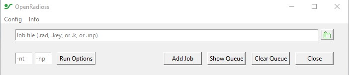

# OpenRadioss GUI

OpenRadioss GUI is a graphical launcher for OpenRadioss on Linux and Windows.

It is a simple Python/tk based tool to execute OpenRadioss, queue jobs and convert OpenRadioss output files to csv, vtk, d3plot at the end of the run

The D3plot converter can be found at: [Vortex-CAE GitHub repository](https://github.com/Vortex-CAE/Vortex-Radioss)

* [Installation](#installation)
* [Execution using GUI Mode](#execution-using-gui-mode)
* [Execution using Batch Mode](#execution-using-batch-mode)

## Installation

* Python3 must be installed on the system.

  Recommended Python3 version is 3.8 or higher.
  OpenRadioss_GUI was tested with Python 3.6.8, some features may not work.

  * On ***Windows***, install Python from [https://www.python.org/downloads/](https://www.python.org/downloads/)
  * On ***Linux***, install python from your OS Repository.

    * On RedHat, CentOS, Rocky Linux

          dnf install python3
          dnf install python3-tkinter

    * On Debian, Ubuntu

          apt-get install python3
          apt install python3-tk

* Get latest [OpenRadioss Release](https://github.com/OpenRadioss/OpenRadioss/releases)

* Copy the contents of openradioss_gui folder in an OpenRadioss Release Download.

## Execution using GUI Mode

* Launch the **OpenRadioss_gui.vbs** on Windows
* Launch the **OpenRadioss_gui.bash** on Linux

### Launch a job

* **Select the Starter input Deck** in .rad, .k or .inp format

  * Click the folder Icon, a browser will appear
  * Browse to the Input deck Directory
  * Select Starter input Deck / Click on Open

* **Enter the number of thread for the job** in the -nt field
* **Enter the number of MPI Domains for the job** in the -np field
* **Click "Add Job"** Run Window apprears.

### Menus

### Config

* ***MPI Path***: Set the ROOT directory to MPI installation. Leave it blank to use system default variables

  * ***Windows (win64)***: ROOT directory to INTEL MPI. Usual IntelMPI installation is located at :

        C:\Program Files (x86)\Intel\oneAPI\mpi\latest

  * ***Linux X86-64 (linux64_gf)***: Path to OpenMPI. OpenRadioss guidelines for OpenMPI locates it in:

        /opt/openmpi

  * ***Linux ARM64 (linuxa64)***: Path to OpenMPI. OpenRadioss guidelines for OpenMPI locates it in:

        /opt/openmpi

### Info

* Menu with usefull informations about OpenRadioss

#### Run Options

Set optional execution options

* **Single Precision**  in Run Options dropdown enables the OpenRadioss single precision version
* **Run Starter Only** in Run Options dropdown executes Starter only.
* **Anim - vtk** in Run Options dropdown invokes the Animation to VTK converter at the end of OpenRadioss Engine simulation.
* **TH - csv** in Run Options dropdown invokes the TH to CSV converter at the end of OpenRadioss Engine simulation.
* **Show Queue** and **Clear Queue** buttons manage the run queue.
* The **info** menu has links to the downloads section of github and an ‘About’ credit to the script creators
* ***Anim - d3plot** in Run Options dropdown appears only if Vortex-CAE D3plot converter is detected.
* ***Anim - vtkhdf** in Run Options dropdown appears only if Kitware animtovtkhdf converter is detected.

### The Run Window

The **Run Windows** has the OpenRadioss output.

Several buttons permits actions during job execution

* **Stop**: stops the job cleanly writing restart (.rst) file(s)
* **Kill**: kills the job (no restarts written)
* **Anim**: writes an Anim file at the current cycle
* **h3d**: writes/updates the h3d file at the current cycle
* **d3plot**: converts any Anim files present in the run folder to d3plot (always converts all anim files present)
* **Close**: becomes available when job is completed, and closes the run window

### The Queue manager

it is possible to submit further jobs from the submission gui after the first and they will be queued for running when the currently running job completes, the queue can be checked and edited, by clicking the ‘Show Queue’ button in the submission gui.

The Job Queue shows jobs queued along with the options chosen, with the buttons in the window it is possible to cancel the next or last job from the queue, or to manually start the next or last job from the queue (this happens in addition to the queue being processed, jobs will open another run window and run at same time as any running job, queue will continue to automatically run any remaining jobs only when 1st one finishes)

## Execution using Batch Mode

OpenRadioss GUI can be used in batch mode for scripting

Launch

* **[Path to OpenRadioss]/openradioss_gui/OpenRadioss_gui.bash -h** on Linux
* **[Path to OpenRadioss]\openradioss_gui\OpenRadioss_gui.bat -h** on Windows

To obtain the command line help:

      usage: OpenRadioss_gui.py [-h] [-gui] [-i INPUT] [-nt n] [-np p] [-sp] [-starter] 
                                [-th_to_csv] [-anim_to_vtk] [-anim_to_d3plot]  
                                [-anim_to_vtkhdf] [-mpi_path MPI_PATH] [-d]

      OpenRadioss GUI

      options:
        -h, --help                         show this help message and exit
        -gui, --gui                        Enable GUI mode
        -i, --input INPUT                  The input file to process in form: filename<.k|.key>, filename_<runnumber 4 digits>.rad or filename.inp
        -nt, --nt n                        Number of threads
        -np, --np p                        Number of MPI process
        -sp, --sp                          Enable Extended Single precision mode (default is double precision)
        -starter, --starter_only           Enable Starter Only mode
        -th_to_csv, --th_to_csv            Enable TH to CSV conversion
        -anim_to_vtk, --anim_to_vtk        Enable Animation to VTK conversion
        -anim_to_d3plot, --anim_to_d3plot  Enable Animation to D3plot conversion (need VortexRadioss installed)
        -anim_to_vtkhdf, --anim_to_vtkhdf  Enable Animation to VTKHDF conversion (need VTKHDF installed)
        -mpi_path, --mpi_path MPI_PATH     Path to MPI installation
        -d, --debug           Enable debug mode

### Typical launch method in SMP

1. Enter the execution directory (where the input deck is)
2. [Path to OpenRadioss]/openradioss_gui/OpenRadioss_gui.bash -i [Input_Deck] -nt [t]

### Typical launch method in MPI

Check your MPI settings in the Shell:

* $PATH & $LD_LIBRARY_PATH for Linux
* %PATH% &  %I_MPI_ROOT% for Windows

#### If MPI settings are already set in shell

1. Enter the execution directory (where the input deck is)
2. [Path to OpenRadioss]/openradioss_gui/OpenRadioss_gui.bash -i [Input_Deck] -np [p]

#### If MPI settings are not set in the shell

1. Enter the execution directory (where the input deck is)
2. [Path to OpenRadioss]/openradioss_gui/OpenRadioss_gui.bash -i [Input_Deck] -np [p] -mpi_path [path to MPI installation]

**Example**:

* On Windows:

      OpenRadioss_gui.bat -i CRA2V44_0000.rad -np 4 -mpi_path "c:\Program Files (x86)\Intel\oneAPI\mpi\2021.16"

* On Linux

      OpenRadioss_gui.bash -i CRA2V44_0000.rad -np 4  -mpi_path=/opt/openmpi
